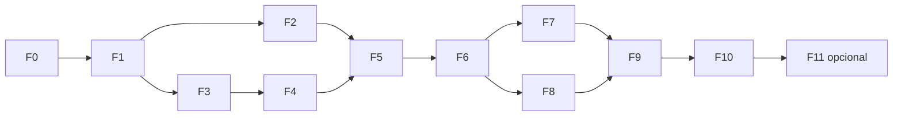

# Plan de proyecto: brazo UR5e simulado controlado por un agente LLM con energía por tarea

**De diseño a proyecto público funcional.** Versión 1.0, 2 de octubre de 2026. Basado en *Informe técnico: agente LLM y energía en un brazo simulado* (mismo día).

> **Cómo leer este plan.** Todos los umbrales son **criterios de aceptación propuestos**, no mediciones. Se fijan antes de construir para que cada fase tenga un "hecho / no hecho" objetivo. Si un umbral resulta irreal, se cambia **por escrito** (ADR en `docs/adr/`) antes de cerrar la fase, nunca después de ver el resultado de la evaluación final. Los elementos marcados **[verificar]** no están comprobados y se resuelven en la fase indicada.

---

## 0. Qué significa "funcional para el público"

Se definen tres niveles de entrega. El proyecto se considera publicado al alcanzar el nivel 2; el nivel 3 es opcional.

| Nivel | Qué recibe el público | Coste de operación | Obligatorio |
|---|---|---|---|
| **1. Reproducible** | Repositorio MIT, imagen Docker, `make demo` que ejecuta un episodio completo en el portátil de cualquiera, **sin GPU y sin clave de API** (modo *replay* con respuestas LLM cacheadas) | 0 € | Sí |
| **2. Benchmark y resultados públicos** | Tareas versionadas como benchmark, dataset de los 400 episodios (logs + trayectorias) con DOI, web estática con tabla de resultados, frente de Pareto y repeticiones 3D de episodios en el navegador, vídeo demo, informe en inglés | ≈0 € (GitHub Pages + Zenodo) | Sí |
| **3. Demo en vivo** | Web donde un visitante elige tarea y configuración y ve al agente resolverla en tiempo real | VM + API LLM: requiere tope de gasto | Opcional |

Principio rector: **el público debe poder reproducir los números del informe sin pagar nada**. Por eso cada respuesta del LLM usada en la evaluación se guarda y el sistema puede re-ejecutarse en modo *replay*.

---

## 1. Resumen de fases

Una fase = un PR contra `main`, con tests, lint y CI en verde, y métricas de aceptación reportadas en `reports/fN_*.json`. No se empieza una fase hasta que la anterior está fusionada.

| Fase | Contenido | Depende de | Semanas (8 h/sem) | Puerta (go/no-go) |
|---|---|---|---|---|
| **F0** | Esqueleto del repo, Docker, CI, calidad | — | 1 | CI verde, imagen construye |
| **F1** | Simulación: UR5e + pinza + mesa + cámara en Gazebo Harmonic, headless en Docker | F0 | 2 | **Puerta crítica 1**: si no arranca en 2 semanas → Franka Panda |
| **F2** | Fuente de par articular (Gazebo vs dinámica inversa) + medidor de energía | F1 | 1 | **Puerta crítica 2**: fuente de par decidida (ADR) |
| **F3** | Percepción `detect()` | F1 | 1 | Error de posición dentro de umbral |
| **F4** | Primitivas con contratos y errores tipados | F1, F3 | 2 | Pick-and-place con código fijo ≥ 95 % |
| **F5** | Tareas, generador de escenas por semilla, línea base A, runner de episodios y esquema de logs | F2, F4 | 1 | **Hito de corte**: A completo con Wh |
| **F6** | Agente LLM B: sandbox, proveedores, caché, *replay*, control de coste | F5 | 2 | Sandbox supera la batería de ataques |
| **F7** | Biblioteca de skills (B+S) | F6 | 1 | Skills validadas y congeladas |
| **F8** | Agente consciente de energía (C, C+S) | F6 (F7 para C+S) | 1 | Piloto en semillas de desarrollo |
| **F9** | Evaluación preregistrada (400 episodios), estadística, informe | F5–F8 | 1 | Análisis reproducible con un comando |
| **F10** | Publicación: paquete, documentación, benchmark, dataset, web de resultados, vídeo | F9 | 2 | Checklist de publicación al 100 % |
| **F11** *(opcional)* | Demo en vivo hospedada | F10 | 2 | Coste y seguridad bajo control |
| — | Colchón | — | 2 | — |

**Total**: 16 semanas de calendario hasta el nivel 2 (14 de trabajo y 2 de colchón), o 18 semanas con F11. A 5–6 h/semana se aplica el recorte pactado del informe (§9).

**Ruta crítica**: F0 → F1 → F2 → F5 → F6 → F9 → F10. F3 y F4 pueden avanzar en paralelo con F2. F7 y F8 son paralelizables entre sí tras F6.



---

## 2. Dependencias

### 2.1 Plataforma

| Componente | Versión propuesta | Motivo | Nota |
|---|---|---|---|
| SO base (contenedor) | Ubuntu 24.04 Noble | Plataforma Tier 1 de ROS 2 Jazzy | El host puede ser cualquier SO con Docker (WSL2 incluido) |
| ROS 2 | Jazzy Jalisco (LTS, soporte hasta mayo de 2029) | Pareja documentada con Gazebo Harmonic | Lyrical Luth descartado por ecosistema (informe §3.2) |
| Gazebo | Harmonic (paquetes *vendor* de ROS) | Combinación recomendada para Jazzy | `ros-jazzy-ros-gz` |
| Docker | Engine ≥ 24 + Compose v2 | Reproducibilidad desde el día 1 | Imagen base `ros:jazzy-ros-base` [verificar tamaño final] |
| Python | 3.12 (el del sistema en Noble) | `rclpy` se compila contra el Python del sistema | Ver gotcha 2.4 |

### 2.2 Paquetes ROS 2 / Gazebo

| Paquete | Uso | Fase |
|---|---|---|
| `ros_gz` (`ros_gz_bridge`, `ros_gz_sim`, `ros_gz_image`) | Puente de topics y lanzamiento de Gazebo | F1 |
| `gz_ros2_control`, `ros2_control`, `ros2_controllers` (`joint_trajectory_controller`, `joint_state_broadcaster`) | Control articular desde ROS | F1 |
| `ur_description`, `ur_simulation_gz` | Modelo y simulación del UR5e para Jazzy | F1 |
| Descripción de pinza (candidata: Robotiq 2F-85) | Agarre | F1 [verificar compatibilidad con Gazebo Harmonic y licencia de mallas] |
| `moveit` (MoveIt 2) | Planificación con obstáculos (tarea 4) | F4, solo si hace falta |
| `cv_bridge`, `image_transport` | Imágenes de la cámara hacia OpenCV | F3 |
| Pinocchio (`ros-jazzy-pinocchio`) | Dinámica inversa como alternativa al esfuerzo de Gazebo | F2 [verificar paquete en Jazzy; si no, `pip install pin`] |
| `rosbag2` con almacenamiento MCAP | Grabación de episodios | F5 |

### 2.3 Paquetes Python (fijados en `uv.lock`)

| Paquete | Uso |
|---|---|
| `numpy`, `scipy` | Cálculo de energía, estadística (bootstrap, Wilson) |
| `opencv-python-headless` (o el `python3-opencv` del sistema) | Percepción. No mezclar ambos |
| `pydantic` v2 | Contratos de primitivas, configuración, esquema de logs |
| `pyyaml` | Configuración |
| `typer` | CLI `armbench` |
| `openai` (cliente compatible) | Proveedor LLM. Sirve para OpenAI, otros proveedores con API compatible y Ollama local |
| `rerun-sdk` | Visualización y repeticiones (ya lo usas en perception3d) |
| `mcap` | Lectura de las grabaciones fuera de ROS |
| `pandas`, `matplotlib` | Tablas y figuras del informe |
| Desarrollo: `pytest`, `pytest-timeout`, `hypothesis`, `ruff`, `mypy`, `pre-commit` | Calidad |

### 2.4 Gotchas de dependencias previstos

1. **`uv` + ROS**: `rclpy` no está en PyPI. El entorno virtual debe crearse con `uv venv --system-site-packages` dentro del contenedor, y el código que no depende de ROS (energía, estadística, sandbox, agente) debe vivir en un paquete Python puro, testeable sin ROS. Así CI corre la mayoría de los tests en segundos, sin la imagen de ROS.
2. **Cámara headless sin GPU**: los sensores de cámara de Gazebo necesitan *rendering*. En Docker sin GPU se usa renderizado por software (EGL/llvmpipe), que puede ser lento. **[verificar en F1]** el FPS de la cámara y el factor de tiempo real (RTF) en CPU.
3. **Determinismo**: Gazebo no es bit a bit determinista entre máquinas. Las comparaciones se hacen pareadas por semilla y en la misma máquina, y se reporta la variación entre repeticiones de una misma semilla (F5).
4. **Licencias**: el código es MIT, pero las mallas del UR5e y de la pinza tienen su propia licencia. Se documentan en `THIRD_PARTY_LICENSES.md` antes de publicar imágenes Docker. **[verificar en F10]**

### 2.5 Hardware objetivo

| Uso | Mínimo propuesto | Nota |
|---|---|---|
| Ejecutar demo (público) | 4 núcleos, 8 GB RAM, sin GPU | Objetivo de usabilidad del nivel 1 |
| Evaluación de 400 episodios | 8 núcleos, 16 GB RAM | Tu portátil (WSL2) sirve |
| LLM local opcional | GPU 8 GB (tu Ada Lovelace) | Para un modelo pequeño vía Ollama; no es obligatorio |

---

## 3. Arquitectura del repositorio

```
armbench/                       # nombre provisional
├── docker/
│   ├── Dockerfile              # ros:jazzy + gz harmonic + ur_simulation_gz + pinza
│   └── compose.yaml            # servicios: sim, agent, (web)
├── ros_ws/src/
│   ├── armbench_description/   # URDF/xacro UR5e + pinza + cámara, mundo SDF
│   ├── armbench_bringup/       # launch files headless/GUI
│   └── armbench_bridge/        # nodo que expone primitivas y medidor de energía
├── src/armbench/               # Python puro, testeable sin ROS
│   ├── energy/                 # modelo de energía A/B, Joule, P0, sensibilidad
│   ├── primitives/             # contratos pydantic + cliente hacia el nodo ROS
│   ├── perception/             # detect() HSV + profundidad
│   ├── tasks/                  # definición de tareas, generador de escenas por semilla, comprobadores de éxito
│   ├── agent/                  # bucle, prompts, proveedores LLM, caché/replay
│   ├── sandbox/                # ejecución aislada del código generado
│   ├── skills/                 # biblioteca, validación, recuperación
│   ├── runner/                 # episodios, semillas, logs JSONL
│   ├── analysis/               # Wilson, bootstrap, IQM, Pareto, figuras
│   └── cli.py                  # `armbench …`
├── configs/                    # energy.yaml, tasks.yaml, agents/*.yaml, seeds.yaml
├── tests/                      # unit (sin ROS), integration (con sim, marca `sim`)
├── docs/                       # informe técnico, ADRs, guía de usuario, benchmark spec
├── site/                       # web estática de resultados (GitHub Pages)
└── reports/                    # JSON de métricas por fase
```

**Separación de semillas** (fijada en `configs/seeds.yaml` y comprobada por test):

| Uso | Semillas | Regla |
|---|---|---|
| Desarrollo (ajuste de prompts y código) | 0–9 | Libre |
| Validación de skills | 20–39 | Solo para aceptar o rechazar skills |
| Evaluación final | 100–119 | **Bloqueadas**: el runner se niega a usarlas salvo con `--final-eval` y un hash de protocolo registrado |

Esto corrige una ambigüedad del informe: la validación de skills tiene su propio rango, distinto del de desarrollo y del de evaluación.

---

## 4. Fases en detalle

Formato de cada fase: **objetivo**, **entregables**, **métricas de aceptación (DoD)**, **riesgos y salida**.

### F0. Esqueleto, Docker y calidad (semana 1)

**Objetivo.** Que cualquier cambio posterior se construya y pruebe de forma automática.

**Entregables**
- Estructura de §3, licencia MIT, `CITATION.cff`, `CONTRIBUTING.md`.
- `pyproject.toml` + `uv.lock` para `src/armbench`, y `pre-commit` con ruff y mypy.
- `docker/Dockerfile` con ROS 2 Jazzy + Gazebo Harmonic (sin brazo todavía).
- Dos pipelines de CI:
  - `verify`: ruff, ruff format, mypy y pytest sin ROS. Corre en cada PR.
  - `sim-image`: construye la imagen Docker y lanza un mundo vacío headless. Corre en PR que tocan `docker/` o `ros_ws/`, con caché de capas.

**DoD**

| Métrica | Umbral |
|---|---|
| CI `verify` | Verde, < 3 min |
| Build de imagen (con caché) | < 15 min en CI |
| Tamaño de imagen | < 4 GB [ajustable vía ADR] |
| Mundo vacío headless | Arranca y publica `/clock` en < 30 s |
| `mypy --strict` en `src/armbench` | 0 errores |

---

### F1. Simulación del brazo (semanas 2–3) — puerta crítica 1

**Objetivo.** UR5e con pinza, mesa, cámara RGB-D y cubos, controlable desde ROS 2 en Docker sin GPU.

**Entregables**
- `armbench_description`: xacro UR5e + pinza + cámara fija + mesa, y un mundo SDF generado a partir de una semilla (posiciones y colores de 3–6 cubos).
- `armbench_bringup`: `sim.launch.py headless:=true|false`.
- Controladores: `joint_trajectory_controller` para el brazo, controlador de la pinza y `joint_state_broadcaster` con **interfaz de estado `effort` declarada**.
- Script `scripts/check_sim.py`: arranca, mueve cada articulación, abre y cierra la pinza, agarra un cubo y escribe `reports/f1_sim.json`.

**DoD**

| Métrica | Umbral |
|---|---|
| Arranques consecutivos sin fallo | 50/50 |
| Tiempo hasta "listo" (controladores activos) | < 60 s headless |
| RTF headless en 4 núcleos, con cámara activa | ≥ 0,5 (objetivo ≥ 0,9) |
| FPS de cámara RGB-D en sim | ≥ 10 Hz |
| Agarre de cubo con trayectoria fija | ≥ 48/50 sin deslizamiento > 5 mm durante el transporte |
| Joint states con `effort` | Publicados para las 6 articulaciones (valor aún sin validar) |

**Riesgos y salida**
- `ur_simulation_gz` no arranca en Docker, o la pinza no funciona en Harmonic, tras **10 días de trabajo** → cambiar a Franka Panda (con pinza integrada) [verificar paquetes para Jazzy] y registrar un ADR.
- El agarre por física es inestable → aumentar la fricción y usar cubos de 4–5 cm. En último caso, agarre por *attach* (plugin de unión), **declarado en el README** como simplificación.

---

### F2. Par articular y medidor de energía (semana 4) — puerta crítica 2

**Objetivo.** Decidir de dónde sale τ e implementar el modelo de energía con tests analíticos.

**Entregables**
- `src/armbench/energy/`: variantes A (sin regeneración) y B (|τ·ω|), término Joule, consumo base P₀ y parámetros en `configs/energy.yaml`.
- **Corrección del modelo del informe**: η se define como eficiencia **excluyendo las pérdidas en el cobre** (reductora + electrónica) para no contarlas dos veces. Queda documentado en el ADR-002.
- Experimento `scripts/torque_source.py`: compara, en 20 trayectorias guionizadas y en sujeción estática, el esfuerzo de Gazebo frente al par por dinámica inversa (Pinocchio, a partir de q, q̇ y q̈ filtradas).
- Nodo `energy_meter`: integra a la frecuencia de joint states, publica Wh acumulado y lo escribe al log del episodio.

**DoD**

| Métrica | Umbral |
|---|---|
| Tests analíticos (velocidad constante, sujeción estática → solo Joule + P₀, potencia negativa en A → 0, B ≥ A siempre) | Error relativo < 1e-6 |
| Test de propiedad (hypothesis): E ≥ 0 y monotonía con T | 1000 casos sin fallo |
| Par de gravedad en sujeción estática, Gazebo vs dinámica inversa | Diferencia < 10 % por articulación; si no se cumple, se usa dinámica inversa |
| Repetibilidad del Wh en la misma trayectoria y semilla (10 repeticiones) | Coeficiente de variación < 2 % |
| Coste computacional del medidor | < 5 % de CPU del contenedor |
| ADR-002 "fuente de τ" | Escrito y fusionado |

---

### F3. Percepción `detect()` (semana 5, en paralelo con F2 si hay tiempo)

**Entregables**
- HSV + contornos + profundidad → pose 3D en el marco de la mesa usando la calibración de la cámara simulada. Reutiliza la geometría *pinhole* de perception3d.
- Generador de 200 escenas por semilla con *ground truth* exportado desde Gazebo.

**DoD**

| Métrica | Umbral |
|---|---|
| Recall de cubos visibles | ≥ 99 % en 200 escenas |
| Falsos positivos | ≤ 1 % |
| Error de posición XY | Mediana < 5 mm, p95 < 10 mm |
| Error de altura (Z) | p95 < 10 mm |
| Latencia de `detect()` | < 50 ms en CPU |
| Lista vacía si no hay objeto, sin excepción | Test de contrato |

---

### F4. Primitivas con contrato (semanas 5–6)

**Entregables**
- Modelos pydantic `Observation`, `Detection`, `Pose`, `Result` y errores tipados: `OutOfReach`, `Singularity`, `Collision`, `Timeout`, `NoObjectGrasped`, `CameraTimeout`.
- `move_to(pose, speed_scale)` con IK analítica del UR (o MoveIt 2 si la tarea 4 lo exige), `grasp()`, `release()`, `observe()` y `execute_skill()` (este último como hueco hasta F7).
- Tests de contrato contra la simulación (marca `sim`).

**DoD**

| Métrica | Umbral |
|---|---|
| Precisión de `move_to` (poses alcanzables aleatorias) | Error de posición p95 < 5 mm, orientación p95 < 2° |
| Detección de pose inalcanzable | 100 % (100 casos) con `OutOfReach` y sin mover el brazo |
| Colisión con la mesa | 0 en 200 movimientos válidos |
| `speed_scale` ∈ [0,1; 1] cambia la duración | Monótono, test |
| Pick-and-place guionizado (detect → move → grasp → move → release) | ≥ 95 % en 100 semillas de desarrollo extendidas |
| Ningún fallo deja la sim en estado inconsistente | `reset()` restaura en < 5 s, 100/100 |

---

### F5. Tareas, línea base A y runner (semana 7) — hito de corte

**Entregables**
- `tasks/`: 4 tareas versionadas (`pick_place@1`, `stack2@1`, `sort3@1`, `place_obstacle@1`) con comprobador de éxito: tolerancia 2 cm, sin colisión, ≤ 60 s de sim.
- Línea base A: solución escrita a mano por tarea.
- Runner `armbench run --task T --agent A --seeds dev` y esquema de log JSONL versionado. Cada episodio registra: éxito, tiempo de sim, Wh (A/B y sensibilidad η), intentos, tokens, latencia, skills, hash de prompt/respuesta y versión de tarea. También se graba el MCAP.
- `armbench report` genera tablas y `reports/f5_baseline.json`.

**DoD**

| Métrica | Umbral |
|---|---|
| Éxito de A por tarea (semillas de desarrollo) | ≥ 95 %; si no se llega, el fallo está en primitivas o tareas, **no se avanza** |
| Wh de A disponible en todas las variantes de sensibilidad | 100 % de episodios |
| Mismo episodio repetido (10×): dispersión de Wh | CV < 3 % |
| Fallos de infraestructura (crash de sim, timeout de bridge) | < 1 % de episodios |
| Duración de un episodio de A | < 2 min de reloj (presupuesto: 400 episodios en < 14 h) |
| Test: el runner rechaza semillas de evaluación sin `--final-eval` | Pasa |

**Hito de corte.** Si F5 no se cierra antes de la semana 9, se aplica el recorte (§9) antes de construir el agente.

---

### F6. Agente LLM B, sandbox y control de coste (semanas 8–9)

**Entregables**
- `agent/`: bucle del informe §3.4 con `N_max` configurable (1 por defecto) y prompt con tarea, estado, firmas de las primitivas y ejemplos.
- `providers/`: interfaz única. Implementaciones: cliente compatible con OpenAI (sirve para proveedores comerciales y para Ollama local) y `ReplayProvider` (lee respuestas cacheadas por hash de prompt).
- Caché en disco por `hash(modelo, temperatura, prompt)` y registro del identificador exacto del modelo y la fecha.
- `sandbox/`, con cuatro capas de defensa:
  1. Análisis AST con lista blanca: solo llamadas a primitivas, aritmética, bucles y `math`; sin `import`, `exec`, `eval`, `open`, `__dunder__` ni acceso a atributos privados.
  2. Proceso hijo sin red (`--network none` o *namespace*) y sin sistema de ficheros escribible.
  3. Límites de CPU, memoria y tiempo.
  4. Comunicación con las primitivas solo vía RPC tipado.
- Tope de gasto: `max_usd_per_run` y `max_tokens_per_episode`; el runner aborta al superarlos.

**DoD**

| Métrica | Umbral |
|---|---|
| Batería de ataques al sandbox (≥ 40 casos: import, red, ficheros, bucles infinitos, bombas de memoria, introspección, escapes por `__class__`/`__subclasses__`) | 100 % bloqueados, tests en CI |
| Código malformado o con excepción | 100 % capturado como `Result` de error, sin caída del runner |
| Modo *replay* | Reproduce exactamente las acciones de un episodio grabado (mismas llamadas a primitivas) |
| Coste medio por episodio | Medido y reportado; extrapolación del coste de la evaluación final < presupuesto (20–30 €) |
| Utilidad mínima de B | ≥ 50 % de éxito en `pick_place` con semillas de desarrollo; por debajo, revisar prompt y primitivas antes de seguir |
| Latencia LLM p95 | Reportada (sin umbral; depende del proveedor) |

---

### F7. Biblioteca de skills, B+S (semana 10)

**Entregables**
- Formato de skill: nombre, descripción, firma, precondiciones y postcondiciones ejecutables, origen (episodio y hash) y versión.
- Validación: una skill entra en la biblioteca solo si pasa en ≥ 9/10 semillas del rango de validación (20–39) **y** el sandbox.
- Recuperación por descripción (lista corta) y deduplicación por firma.
- **La biblioteca se construye con semillas de desarrollo y validación, y se congela (hash) antes de F9.** Durante la evaluación es de solo lectura. Así se elimina el efecto del orden de las semillas.

**DoD**

| Métrica | Umbral |
|---|---|
| Postcondiciones detectan un fallo inyectado | 100 % en tests |
| Biblioteca congelada con hash registrado | Sí |
| Piloto B vs B+S (semillas de desarrollo) | Reportado: tokens, latencia, llamadas, éxito. Sin umbral de mejora: es la hipótesis H1, no un requisito |

---

### F8. Agente consciente de la energía, C y C+S (semana 11)

**Entregables**
- Prompt con presupuesto de Wh por tarea (por ejemplo, la mediana de A en semillas de desarrollo × factor) y explicación de las palancas (`speed_scale` y rutas más cortas).
- **Definición de "Wh del intento anterior"** (resuelve la ambigüedad del informe): con `N_max = 1`, C recibe el Wh de **su último episodio de la misma tarea en semillas de desarrollo** (memoria de energía fija, congelada como las skills). Con `N_max > 1`, también recibe el Wh del intento previo del mismo episodio. Se fija una de las dos opciones en un ADR antes de F9.

**DoD**

| Métrica | Umbral |
|---|---|
| C usa la palanca de energía (fracción de episodios con `speed_scale` < 1) | Reportado |
| Piloto C vs B en semillas de desarrollo | Reportado, sin umbral (es la H2) |
| Ninguna configuración viola el tope de gasto | 0 aborts por coste en el piloto |

---

### F9. Evaluación preregistrada (semana 12)

**Entregables**
- `docs/protocol.md` congelado: configuraciones, tareas@versión, semillas, modelo LLM exacto, temperatura, métricas, análisis y criterio de "ahorro". **Se hace commit del protocolo y su hash va en cada log antes de ejecutar** (preregistro).
- Ejecución de 5 configuraciones × 4 tareas × 20 semillas = 400 episodios. Las respuestas LLM quedan en caché.
- `armbench analyze`: Wilson por celda, medianas e IQM con IC bootstrap (10 000 remuestreos), diferencias pareadas por semilla, sensibilidad (A/B × η = 0,6/0,8), frente de Pareto (éxito, Wh por episodio exitoso, tiempo) e informe Markdown/PDF.

**DoD**

| Métrica | Umbral |
|---|---|
| Episodios válidos (sin fallo de infraestructura) | ≥ 99 %; los fallidos se re-ejecutan y se reportan |
| Reproducción del análisis desde los logs | `armbench analyze logs/ --out report/` regenera todas las tablas y figuras; mismo hash con la misma semilla de bootstrap |
| Reproducción desde *replay* en otra máquina | Éxito idéntico por episodio; Wh dentro de ±3 % |
| Afirmación de ahorro (H2) | Solo si la diferencia pareada en Wh es negativa con IC 95 % que excluye 0 **en las 4 variantes de sensibilidad**; si no, se reporta como nulo o mixto |
| Escenario resultante (favorable/mixto/nulo/fallo) | Declarado según el informe §6 |

---

### F10. Publicación (semanas 13–14)

**Entregables**

1. **Paquete y CLI**
   - `armbench` en PyPI (solo la parte Python pura: energía, análisis, *replay*, cliente), con Trusted Publishing como en AIComply.
   - Imagen Docker en GHCR con etiquetas semánticas (`v1.0.0`) y `latest`.
2. **Quickstart de 3 comandos**:
   ```bash
   git clone https://github.com/aiambo08/armbench && cd armbench
   docker compose pull
   docker compose run --rm agent armbench demo --task pick_place --agent C --replay
   ```
   Salida esperada: episodio completo, éxito `True`, Wh impreso y un fichero `.rrd` para verlo en Rerun.
3. **Benchmark**: `docs/benchmark.md` con la especificación de las tareas@versión, la API de primitivas, el formato de log y cómo enviar resultados de un agente nuevo (PR con logs → tabla).
4. **Dataset**: logs JSONL + MCAP + caché LLM de los 400 episodios en Zenodo (DOI), con licencia CC BY 4.0.
5. **Web estática** (GitHub Pages):
   - Tabla de resultados con IC, frente de Pareto interactivo y repeticiones 3D en el navegador de episodios seleccionados (visor web de Rerun cargando `.rrd`, o three.js + URDF) [verificar la opción con menos peso].
   - Vídeo demo de 60–90 s: B vs C lado a lado con Wh.
6. **Documentación**:
   - README en inglés: problema, diagrama, quickstart, resultados, *Limitations* y definición del modelo de energía.
   - `docs/` con guía de usuario, arquitectura, ADRs e informe técnico en inglés de 2 páginas + versión larga.
7. **Seguridad**: `SECURITY.md` (cómo reportar), descripción del sandbox y aviso de que ejecutar con un LLM real envía datos del prompt al proveedor elegido.
8. **Licencias**: `THIRD_PARTY_LICENSES.md` (mallas UR, pinza, dependencias).

**DoD (checklist de publicación)**

| Métrica | Umbral |
|---|---|
| Instalación limpia (VM nueva, Linux y Windows+WSL2) hasta el primer episodio | ≤ 3 comandos y ≤ 30 min (incluida la descarga) |
| Demo sin GPU y sin clave de API | Funciona (modo *replay*) |
| Demo con LLM local (Ollama) | Documentada y probada en tu GPU |
| Cobertura de tests de `src/armbench` | ≥ 80 % de líneas |
| CI en `main` | Verde, incluido un smoke test de simulación de 1 episodio |
| Enlaces de la documentación | 0 rotos (comprobador en CI) |
| Web de resultados | Carga en < 3 s y repeticiones 3D funcionando en Chrome y Firefox |
| Versionado | Tag `v1.0.0`, CHANGELOG, DOI del dataset enlazado desde el README |
| Lenguaje | "built" solo para lo medido; las limitaciones están explícitas |

---

### F11 (opcional). Demo en vivo (semanas 15–16)

**Arquitectura propuesta**: una VM CPU (8 vCPU) con la sim headless y un *worker* por episodio; frontend estático que se conecta por WebSocket (foxglove_bridge o *stream* de Rerun) [verificar]; cola con un episodio a la vez por visitante.

**Controles obligatorios**
- Solo tareas y configuraciones predefinidas. **El visitante no escribe prompts libres**, para evitar inyección de prompts y abuso del LLM.
- Límite de N episodios por IP y día, Turnstile o captcha, tope de gasto mensual en el proveedor LLM y fallback automático a *replay* al alcanzar el tope.
- El sandbox de F6 es la única vía de ejecución; contenedor sin red salvo hacia el proveedor LLM.

**DoD**

| Métrica | Umbral |
|---|---|
| Tiempo hasta ver el brazo moverse | < 20 s p95 |
| Disponibilidad durante 2 semanas de prueba | ≥ 99 % |
| Coste mensual | ≤ tope fijado (propuesta: 30 €/mes, a recalcular con tarifas reales) |
| Test de abuso (ráfaga de 100 peticiones) | El límite se aplica y no se superan costes |

---

## 5. Métricas globales del proyecto

Además de las métricas por fase, el proyecto publicado debe cumplir estas:

| Dimensión | Métrica | Umbral |
|---|---|---|
| Fiabilidad | Fallos de infraestructura por episodio | < 1 % |
| Reproducibilidad | Re-ejecución en *replay* en otra máquina | Éxito idéntico; Wh ±3 % |
| Reproducibilidad | Análisis desde logs | Determinista con semilla de bootstrap fija |
| Rendimiento | Duración media de un episodio | < 2 min de reloj en 8 núcleos |
| Calidad | Cobertura de `src/armbench` | ≥ 80 % |
| Calidad | ruff, mypy `--strict` | 0 errores |
| Seguridad | Batería de ataques al sandbox | 100 % bloqueados |
| Coste | Coste total de la evaluación LLM | ≤ 30 € (recalcular en F6) |
| Usabilidad | Quickstart | ≤ 3 comandos, ≤ 30 min |
| Honestidad científica | Afirmaciones de ahorro | Solo con IC que excluya 0 en las 4 variantes de sensibilidad |

Los resultados de la investigación (H1–H3) **no son métricas de aceptación**: el proyecto está "terminado" aunque las hipótesis salgan nulas, siempre que el resultado esté bien medido y publicado.

---

## 6. Riesgos y planes de contingencia

| # | Riesgo | Prob. (est.) | Impacto | Señal temprana | Contingencia |
|---|---|---|---|---|---|
| R1 | `ur_simulation_gz` no arranca en Docker / Jazzy | Media | Alto | Día 5 de F1 sin brazo moviéndose | Franka Panda (ADR); límite de 10 días |
| R2 | Pinza no funciona en Harmonic | Media | Alto | F1 | Otra pinza o *attach* declarado |
| R3 | Esfuerzo de Gazebo ruidoso o ausente | Media | Medio | F2, test de gravedad | Dinámica inversa con Pinocchio |
| R4 | Cámara headless demasiado lenta en CPU | Media | Medio | F1, RTF < 0,5 | Bajar resolución y FPS; percepción "oráculo" declarada como modo alternativo |
| R5 | Agarre inestable | Alta | Medio | F1/F4 < 95 % | Fricción, tamaño de cubo, *attach* |
| R6 | LLM con tasa de éxito muy baja | Media | Alto | F6 < 50 % en pick_place | Mejorar prompt, ejemplos y primitivas de más alto nivel |
| R7 | Coste de API superior al previsto | Media | Medio | Extrapolación de F6 | Modelo más barato o local, caché, reducir a 10 semillas |
| R8 | Retirada del modelo LLM usado | Media | Bajo (con caché) | — | *Replay* + ID exacto del modelo publicado |
| R9 | Escape del sandbox | Baja | Muy alto en F11 | Batería de ataques | No hay demo en vivo sin el 100 % de la batería; F11 sin prompts libres |
| R10 | Carga lectiva / exámenes | Segura | Medio | — | Recorte (§9) y 2 semanas de colchón |
| R11 | Licencias de mallas incompatibles con redistribuir la imagen | Baja | Medio | F10 | Descargar mallas en el build en lugar de redistribuirlas |

---

## 7. Decisiones abiertas a cerrar (con fase límite)

| # | Decisión | Recomendación | Fase límite |
|---|---|---|---|
| D1 | Stack | Jazzy + Harmonic | F0 |
| D2 | Brazo y pinza | UR5e + Robotiq 2F-85 [verificar]; alternativa Panda | F1 |
| D3 | Fuente de τ | La que pase el test de gravedad de F2 | F2 |
| D4 | η sin pérdidas en el cobre | Sí (evita el doble conteo) | F2 |
| D5 | Agente: un turno vs reintentos | Un turno en la evaluación principal; reintentos como experimento extra si sobra tiempo | F6 |
| D6 | Modelo LLM y proveedor | Uno comercial barato para la evaluación + uno local para la demo pública | F6 |
| D7 | Biblioteca de skills congelada | Sí | F7 |
| D8 | Significado de "Wh anterior" en C | Memoria de energía congelada desde semillas de desarrollo | F8 |
| D9 | Nombre del proyecto y del repo | Provisional `armbench`; comprobar que el nombre está libre en PyPI y GitHub | F0 |
| D10 | Hacer o no F11 | Decidir tras F10 según presupuesto | F10 |

---

## 8. Forma de trabajo

- **Un PR por fase**, siempre contra `main`; la rama se borra tras fusionar. Los arreglos pequeños van en un PR aparte.
- Cada PR incluye `reports/fN_*.json` con las métricas de la tabla DoD y una sección "DoD: cumple / no cumple" en la descripción.
- Lo que requiere tu máquina (GPU para LLM local, evaluación larga en WSL2) se entrega con comandos numerados y copiables, y con el JSON que hay que devolver.
- Los cambios de umbral, stack o protocolo se hacen mediante ADR, **nunca después de ver resultados de evaluación**.
- Todos los tests de lógica viven en Python puro y corren sin ROS en CI; los tests con simulación llevan la marca `sim` y se ejecutan en el job de imagen.

---

## 9. Recorte pactado (si el tiempo no alcanza)

En este orden, hasta recuperar el calendario:

1. Quitar F11.
2. Bajar de 20 a 10 semillas por celda (mínimo; por debajo, los IC son inútiles).
3. Quitar la tarea 4 (obstáculo) y con ella MoveIt 2.
4. Quitar C+S (queda A, B, B+S y C).
5. Percepción "oráculo" (pose desde Gazebo) declarada, si F3 se atasca.

Lo que **no** se recorta: el modelo de energía con sensibilidad, el sandbox, el modo *replay*, el preregistro y la sección *Limitations*.

---

## 10. Siguiente paso concreto

Cerrar D9 (nombre del repo) y crear el repositorio vacío en GitHub. Con eso se abre **F0** como primer PR.
